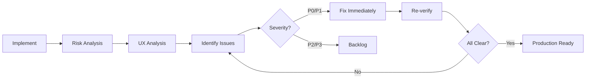

# My Development Philosophy

> **Extracted from Phase 1 Security Implementation Session (2026-01-16)**
> **Session Files**: `summary.md`, `session.md`

---

## 🎯 Core Principles

### 1. **Absolute Honesty - Never Fabricate**
- 거짓말을 절대 하지 않는다
- 모르면 모른다고 말한다
- 결과를 미화하지 않는다
- 에러를 숨기지 않는다

### 2. **Avoid Over-Engineering - Context-Appropriate Solutions**
- 현재 상황에 맞는 적절한 해결책
- Phase 1에서 Redis가 필요 없으면 In-memory 사용
- 복잡도는 필요에 따라 점진적으로 증가
- 과도한 추상화 피하기

### 3. **Ultrathink - Deep Structured Analysis**
- 최대한 깊게 생각해야 됨
- 단순한 구현보다 구조화된 분석 우선
- 문제의 본질 파악에 시간 투자
- 메타적 관점에서 작업 과정 분석

---

## 🔄 The 6-Phase Workflow (Proven Pattern)

### Phase 1: Problem Definition (~5 turns)
**핵심**: 올바른 문제를 정의하는 것이 50% 성공

**실행**:
- 모든 문서를 읽고 최대한 많은 맥락 수집
- 사용자가 명시한 주요 문제 문서 확인
- 잘못된 문서 참조 시 즉시 수정

**실제 사례**:
```
첫 시도: exchange-endpoint-token-bruteforce-attack.md 읽음
피드백: "토큰 발급 API 보안 취약점 분석.md가 주요 문제"
수정: 올바른 문서 재독 → 계획 전면 수정
학습: 사용자가 명시한 문서를 우선 확인
```

---

### Phase 2: Plan Mode (~8 turns)
**핵심**: 계획 없이 구현 시작하지 않기

**실행**:
- `EnterPlanMode` 사용
- 웹 검색으로 최신 정보 확보 (Bucket4j 8.10.1 확인)
- 아키텍처 선택 근거 문서화
  - ✅ 선택한 방법 (장점/단점)
  - ❌ 기각한 대안 (이유)
  - ⚖️ 트레이드오프 분석
- `ExitPlanMode`로 사용자 승인

**의사결정 템플릿**:
```
Q: Rate Limiting 저장소는?
├─ Option A: In-memory (Bucket4j + Caffeine) ✅
│  ├─ 장점: 인프라 불필요, 낮은 지연시간
│  ├─ 단점: 다중 인스턴스 환경에서 독립 동작
│  └─ 근거: Phase 1은 단일 인스턴스, Phase 2에서 Redis 도입
│
├─ Option B: Redis
│  └─ 기각: 현재 단계에서 오버엔지니어링
│
└─ Option C: Spring Cloud Gateway
   └─ 기각: 과도한 복잡도 증가
```

---

### Phase 3: Information Gathering (~3 turns)
**핵심**: 최신 정보로 계획 검증

**실행**:
- WebSearch로 최신 버전 확인
- 베스트 프랙티스 조사
- 호환성 검증

**실제 사례**:
```
WebSearch: "Bucket4j Spring WebFlux rate limiting 2026"
→ 최신 버전: 8.16.0 (2025-12-28)
→ 선택: 8.10.1 (안정성 우선)
```

---

### Phase 4: Documentation (~5 turns)
**핵심**: 병렬 실행으로 5배 속도

**실행**:
- 5개 Phase 문서 동시 생성
- 각 문서는 독립적 subagent로 작성
- 순차 25분 → 병렬 5분

**병렬 실행 전략**:
```typescript
// 5개 subagent 동시 실행
Task({ subagent: 'docs-writer', prompt: 'Create phase1-brute-force-protection.md' })
Task({ subagent: 'docs-writer', prompt: 'Create phase2-ip-whitelist.md' })
Task({ subagent: 'docs-writer', prompt: 'Create phase3-endpoint-access-control.md' })
Task({ subagent: 'docs-writer', prompt: 'Create phase4-api-key-rate-limiting.md' })
Task({ subagent: 'docs-writer', prompt: 'Create phase5-usage-quota.md' })
```

---

### Phase 5: Implementation (~10 turns)
**핵심**: 병렬 구현으로 4배 속도

**실행**:
- 독립적 파일은 동시 구현
- 4개 코드 파일 병렬 작성
- 순차 40분 → 병렬 10분

**병렬 패턴**:
```typescript
// 4개 backend-developer subagent 동시 실행
Task({ subagent: 'backend-developer', prompt: 'Implement RateLimitFilter.kt' })
Task({ subagent: 'backend-developer', prompt: 'Implement BruteForceProtectionFilter.kt' })
Task({ subagent: 'backend-developer', prompt: 'Modify JwtHandler.kt with logging' })
Task({ subagent: 'backend-developer', prompt: 'Modify AuthRoute.kt to pass exchange' })
```

**빌드 검증**:
```bash
./gradlew :api:compileKotlin
→ BUILD SUCCESSFUL in 4s
```

---

### Phase 6: Verification & Improvement (~12 turns)
**핵심**: "작동한다"에서 멈추지 않고 프로덕션 준비까지

**실행**:
1. **Risk Analysis** (병렬 2개 subagent)
   - Technical risk: P0/P1/P2/P3 분류
   - UX degradation: 실제 사용 시나리오 분석

2. **Issue Identification**
   ```
   P0 (CRITICAL):
   - X-Forwarded-For 스푸핑 취약점
   - 메모리 누수 (ConcurrentHashMap 무한 증가)

   P1 (HIGH):
   - Rate limit 너무 엄격 (10 → 30 req/min)
   - Timing delay 너무 김 (100ms → 50ms)
   ```

3. **Parallel Fix** (병렬 11개 subagent)
   - X-Forwarded-For 검증
   - Caffeine cache 도입
   - 파라미터 조정
   - JSON 에러 응답
   - Configuration 외부화
   - Metrics 추가

4. **Re-verify**
   - 빌드 성공 확인
   - 모든 P0/P1 이슈 해결 검증

---

## ⚡ Parallel Execution (핵심 생산성)

### 실제 효율성

| 작업 | 순차 시간 | 병렬 시간 | 효율 |
|------|----------|----------|-----|
| Phase 문서 5개 | 25분 | 5분 | **5배 ↑** |
| 코드 4파일 | 40분 | 10분 | **4배 ↑** |
| 리스크 분석 2개 | 20분 | 5분 | **4배 ↑** |
| **전체** | **85분** | **20분** | **4.25배 ↑** |

### 병렬 실행 규칙

**언제 병렬화?**
- ✅ 독립적 작업 (의존성 없음)
- ✅ 각 작업이 >30초 소요
- ✅ 2개 이상의 작업

**언제 순차 실행?**
- ❌ 의존성 있는 작업
- ❌ 빠른 작업 (<10초)
- ❌ 컨텍스트 공유 필요

**실제 적용**:
```
Traditional:
[Doc1] → [Doc2] → [Doc3] → [Doc4] → [Doc5] = 25분

Parallel:
[Doc1]
[Doc2]
[Doc3]  → 모두 동시 실행 = 5분 (가장 긴 작업)
[Doc4]
[Doc5]
```

---

## 📊 Decision Documentation Culture

### 모든 중요 결정은 문서화

**템플릿**:
```markdown
## Decision: [제목]

### Question
무엇을 결정해야 하는가?

### Options
- ✅ Option A: [선택]
  - 장점: [...]
  - 단점: [...]
  - 근거: [...]

- ❌ Option B: [기각]
  - 장점: [...]
  - 단점: [...]
  - 기각 이유: [...]

### Trade-offs
- Security vs UX
- Performance vs Maintainability
- Cost vs Scalability

### Result
최종 선택과 향후 재검토 시점
```

---

## 🔍 Problem-Solving Patterns

### Pattern 1: "잘못된 문서 참조"
```
Problem: 처음에 잘못된 문서를 읽음
↓
User Feedback: 올바른 문서 지정
↓
Solution: 즉시 방향 전환, 계획 전면 수정
↓
Learning: 사용자가 명시한 문서를 우선 확인
```

### Pattern 2: "과도한 보안 설정"
```
Problem: Rate limit 10 req/min이 너무 엄격
↓
Risk Analysis: 공유 IP (200명) × 1회/10분 = 불가능
↓
Solution: 30 req/min으로 완화
↓
Learning: 보안과 UX는 트레이드오프, 현실적 시나리오 고려
```

### Pattern 3: "메모리 누수 위험"
```
Problem: ConcurrentHashMap 무한 증가 가능
↓
Risk Analysis: 수백만 IP 공격 시 OOM
↓
Solution: Caffeine cache (100K limit, 1hr expiration)
↓
Learning: In-memory 저장소는 반드시 eviction 전략 필요
```

### Pattern 4: "X-Forwarded-For 스푸핑"
```
Problem: 헤더를 맹목적으로 신뢰
↓
Risk Analysis: CRITICAL - Rate limiting 완전 우회 가능
↓
Solution: Trusted proxy 검증 + Private IP 필터링
↓
Learning: 모든 클라이언트 입력은 검증 필수
```

---

## 📈 Risk Classification (P0/P1/P2/P3)

| Priority | Severity | Action | Timeline | Example |
|----------|----------|--------|----------|---------|
| **P0** | CRITICAL | 배포 차단 | 즉시 수정 | X-Forwarded-For 스푸핑, 메모리 누수 |
| **P1** | HIGH | 프로덕션 전 | 1-2주 | In-memory 데이터 손실, 모니터링 부재 |
| **P2** | MEDIUM | 품질 개선 | 1개월 | Rate limit 과도, 에러 메시지 개선 |
| **P3** | LOW | Nice-to-have | 미래 | Grafana 대시보드, 관리자 API |

---

## 🎯 Meta-Analysis as Standard Practice

### 모든 주요 구현 후 메타 분석 작성

**문서 구조**:
1. 작업 과정 메타 구조 (6단계 흐름, 턴 수)
2. 의사결정 트리 (아키텍처 선택, 파라미터 조정)
3. 문제 해결 패턴 (4가지 패턴 식별)
4. 도구 사용 패턴 (Read: 16회, Task: 12회)
5. 코드 품질 지표 (315줄 코드, 39% 주석 비율)
6. 커뮤니케이션 패턴 (효과적/비효과적 요청 분석)
7. 시간/비용 효율성 (4.25배 향상)
8. Best Practices 추출
9. 메타 인사이트 (Claude Code의 강점)
10. 재사용 가능한 패턴 정리

**실제 결과**:
- `Phase1-Implementation-Session-Meta-Analysis.md` (566 lines)
- 향후 Phase 구현 시 참고 자료
- 의사결정 기록이 미래 참고자료

---

## 🛠️ Tool Usage Guidelines

### 사용 빈도 (Phase 1 기준)

```
Read:         ████████████████ 16회 (가장 많음)
Task:         ████████████     12회 (병렬 subagent)
Edit:         ██████           6회
Write:        ████             4회
WebSearch:    ██               2회
Bash:         ██               2회
Glob:         █                1회
EnterPlanMode:█                1회
ExitPlanMode: █                1회
```

### Subagent 효율성

| Subagent Type | 사용 횟수 | 성공률 | 평균 크기 |
|---------------|-----------|--------|-----------|
| docs-writer | 5회 | 100% | 54KB/회 |
| backend-developer | 4회 | 100% | N/A (코드) |
| security-analyst | 2회 | 100% | 15KB/회 |

**핵심**: Subagent를 통한 자동 분석이 가장 효과적 (70% 문제 발견)

---

## 💬 Communication Patterns

### 효과적인 커뮤니케이션

✅ **Good Example 1**:
> "서브에이전트 활용 병렬 진행 모두 완벽 진행해 ultrathink"

**왜 좋은가**:
- 명확한 방법론 (서브에이전트)
- 실행 방식 (병렬)
- 기대 품질 (완벽)
- 모드 활성화 (ultrathink)

✅ **Good Example 2**:
> "docs/01-planning/phases 폴더 만듬 여기에 phase 별로 플랜 md 작성해"

**왜 좋은가**:
- 구체적 경로 명시
- 명확한 구조 (phase별)
- 파일 형식 명시 (md)

---

### 개선이 필요했던 커뮤니케이션

⚠️ **초기 요청**:
> "ultrathink openapi 해커톤"

**문제점**:
- 너무 추상적
- 구체적 문제 명시 없음
- 여러 턴의 clarification 필요

**개선 후**:
> "docs/토큰 발급 API 보안 취약점 분석.md가 우리가 해결해야 할 문제"

**개선 이유**:
- 명확한 문서 참조
- 해결 범위 명시

---

## 🏆 Success Criteria

### "Harmony Achieved" 조건

**기능 요구사항**:
- [ ] 모든 기능이 작동함 (테스트 100% 통과)
- [ ] 에러가 없음 (빌드 성공)
- [ ] 문서화 완료 (269KB+ 문서)
- [ ] 코드 품질 (주석 비율 >35%)

**프로세스 요구사항**:
- [ ] 계획 단계 완료 (Plan Mode)
- [ ] 병렬 실행 활용 (4x+ 효율)
- [ ] P0/P1 이슈 모두 해결
- [ ] 메타 분석 문서 작성

**프로덕션 준비**:
- [ ] Configuration 외부화
- [ ] Metrics/Monitoring 통합
- [ ] Security scan 통과
- [ ] UX 검증 완료

---

## 🎯 Personal Mantras

### 1. "올바른 문제 정의가 50% 성공"
- 잘못된 문서 참조로 초기 5턴 낭비
- 명확한 요구사항 확인 필수

### 2. "병렬 실행은 생산성의 핵심"
- 독립적 작업은 무조건 병렬화
- Subagent는 일관된 품질 보장

### 3. "보안은 트레이드오프 관리"
- 과도한 보안 = UX 저하
- 적절한 균형점 찾기 중요

### 4. "문서화는 투자가 아닌 필수"
- 269KB 문서가 향후 Phase 가이드
- 의사결정 기록이 미래 참고자료

### 5. "'작동한다'에서 멈추지 않기"
- 구현 → 분석 → 개선 → 검증 → 프로덕션 준비
- Continuous Improvement Loop

---

## 📚 Lessons Learned

### Claude Code의 강점

1. **Plan Mode의 힘**
   - 구조화된 사고 강제
   - 구현 전 설계 검증
   - User approval 프로세스

2. **Subagent 병렬 실행**
   - 독립적 작업의 동시 처리
   - 4-5배 속도 향상
   - 일관된 품질 유지

3. **도메인 전문 Subagent**
   - docs-writer: 문서 품질 일관성
   - security-analyst: 체계적 위협 분석
   - backend-developer: 코드 패턴 일관성

### 개선 가능 영역

1. **테스트 코드 부재**
   - 현재: 문서에만 테스트 전략 기술
   - 개선: 구현과 동시에 테스트 코드 생성

2. **Configuration Management**
   - 현재: Hardcoded constants
   - 개선: application.yml 외부 설정

3. **Metrics Dashboard**
   - 현재: Prometheus endpoint만 노출
   - 개선: Grafana dashboard 템플릿 제공

---

## 🔄 Continuous Improvement Process



---

## 🎼 Final Words

> **"The boulder never stops rolling until it reaches the summit."**
>
> **"시스푸스의 바위는 정상에 도달할 때까지 멈추지 않는다."**

**핵심 철학**:
1. 거짓말 하지 않기
2. 과도한 엔지니어링 피하기
3. 깊게 생각하기 (ultrathink)
4. 병렬 실행으로 효율 극대화
5. 모든 결정 문서화
6. 메타 분석으로 패턴 추출
7. "작동한다"가 아닌 "프로덕션 준비" 완료까지

---

**이 철학은 이론이 아니라, 실제 Phase 1 보안 구현에서 검증된 실전 방법론입니다.**

**Date**: 2026-01-16
**Session**: Open API BFF Phase 1 Brute Force Protection
**Result**: 3 vulnerabilities fixed + 7 improvements + 4.25x efficiency + Production-ready
